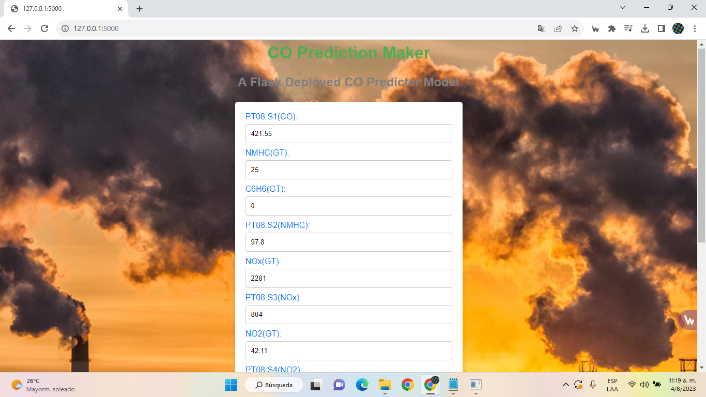
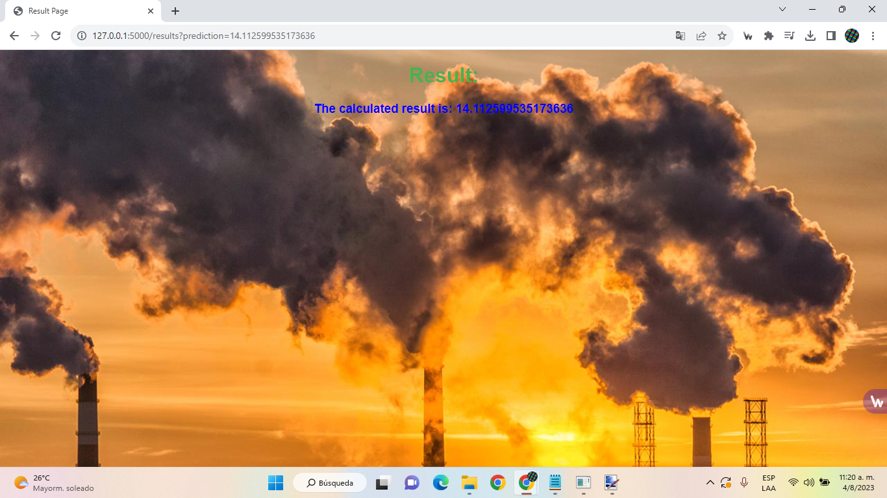

# Week 4 of Data Glacier Intership - Deployment Flask

This repository is for week 4 of Data Glacier Intership "Deployment on Flask" project, where I create a linear regression model to predict CO concentrations given other common substances as input

## How to run

> Help guidance from: https://stackoverflow.com/questions/31252791/flask-importerror-no-module-named-flask

1. Clone this repository locally or download the zip file

2. Open terminal

3. Go to 'Week 4'/src/ using cd

4. Create virtual flask environment ``virtualenv flask``

> NOTE: You may need to install flask module first ``pip install flask``

5. Go to the flask enviornment folder ``cd flask``

6. Run the enviornment ``source bin/activate``

7. Return to src folder ``cd ..``

8. Run with python ``python web_app.py``

9. On your browser, go to: http://127.0.0.1:5000/

That's it! Now you can fill up the input values and make predictions.

## Data info

The dataset used for this proyect was provided by FEDESORIANO *(Saverio De Vito (saverio.devito '@' enea.it), ENEA - National Agency for New Technologies, Energy and Sustainable Economic Development)*, details of data collection and meaning of each value are described by FEDESORIANO online at:

* [Dataset Kaggle link](https://www.kaggle.com/datasets/fedesoriano/air-quality-data-set)

---

S. De Vito, E. Massera, M. Piga, L. Martinotto, G. Di Francia, On field calibration of an electronic nose for benzene estimation in an urban pollution monitoring scenario, Sensors and Actuators B: Chemical, Volume 129, Issue 2, 22 February 2008, Pages 750-757, ISSN 0925-4005.
[*article_source*](https://www.sciencedirect.com/science/article/abs/pii/S0925400507007691)

---

"This dataset contains the responses of a gas multisensor device deployed on the field in an Italian city. Hourly responses averages are recorded along with gas concentrations references from a certified analyzer. This dataset was taken from UCI Machine Learning Repository: <https://archive.ics.uci.edu/ml/index.php>"

---

**Data PDF document:**

[Dataset specifications](data_doc/Data_Intake_Report.pdf)

## Project details

[Presentation](flask_doc/flask.pdf)

## Questions & Feedback

If you have any questions about the proyect, suggestions or want to spot a mistake, please let me know by creating a new issue or writing me at:

<ALEXANDER.QUESADAQUESADA@ucr.ac.cr>

## License

See the LICENSE file for license rights and limitations (MIT).
